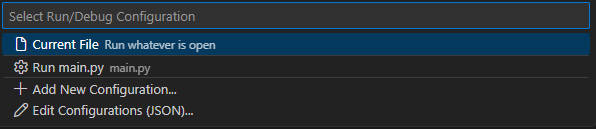

# runEntryPoint

Run your entry point in status bar, similar to the way you run your entry point in Pycharm.

## Show in Status Bar

## Popup

## Features

- Select your entry point or current file in profile.
- Run or Debug your entry point with a single click.

## Release Notes

### 0.0.1

Initial release

### 0.0.2

- fix PowerShell compatibility on Windows
- add images in README.md
- fix the package size issue(only include necessary files)

### 0.0.3

- fix naming issue
- add descriptions

---

**Enjoy!**
